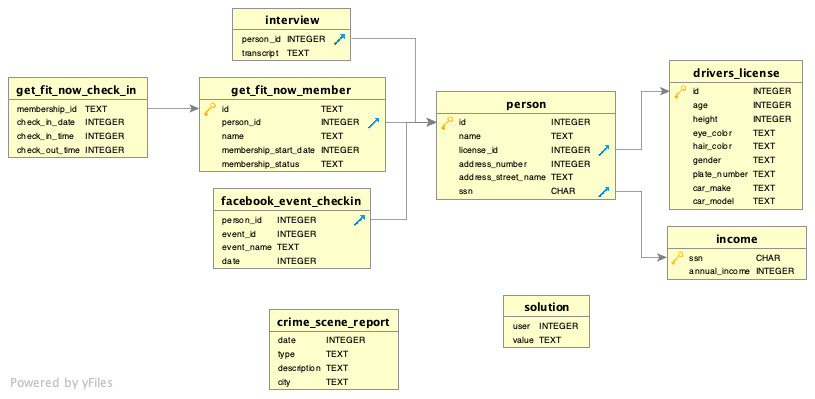
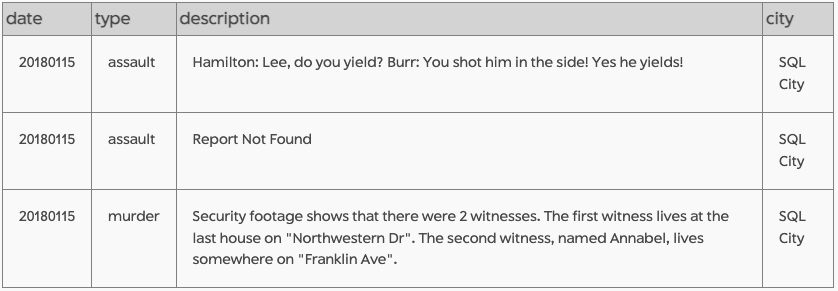
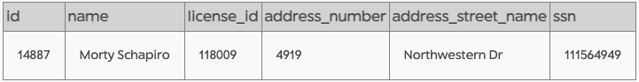
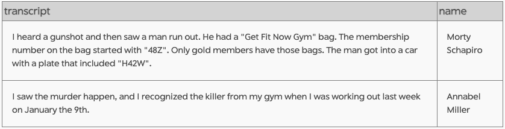
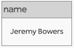
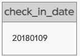
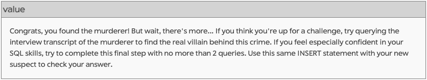
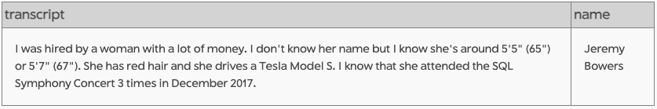

# SQL Murder Mystery approach and solutions

## The case summary
A crime has taken place and the detective needs your help. The detective gave you the crime scene report, but you somehow lost it. You vaguely remember that the crime was a ​murder​ that occurred sometime on ​Jan.15, 2018​ and that it took place in ​SQL City​. 

## Database
The SQL Murder Mystery was built using SQLite.

## ERD

## Step 1
Retrieve the crime scene report from the police department’s database, using information provided in the case summary.

    SELECT * 
    FROM crime_scene_report 
    WHERE ='SQL city'
    AND date ='20180115';   

## Step 2

Use the results from Step 1 to identify the two witnesses.

Identify witness 1:
    SELECT *
    FROM person
    WHERE address_street_name ='Northwestern Dr'
    ORDER BY address_number DESC LIMIT 1;

Identify witness 2:
    SELECT *
    FROM person
    WHERE name LIKE 'Annabel%'
    AND address_street_name='Franklin Ave;

## Step 3

Have a look at the interview transcripts for the two witnesses that have now been identified.

    SELECT i.transcript, p.name
    FROM interview i
    JOIN person p
    ON i.person_id = p.id
    WHERE name='Annabel Miller'
    OR name='Morty Schapiro';

## Step 4

Use the information provided in Morty Schapiro's transcript to get the name(s) of the murderer.

    SELECT m.name
    FROM get_fit_now_member m
    JOIN person p
    ON m.person_id = p.id
    JOIN drivers_license dl
    ON p.license_id = dl.id
    WHERE m.id LIKE '48Z%'
    AND m.membership_status='gold'
    AND dl.plate_number LIKE '%H42W%';

Confirm the killer's name fits with the details reported in Annabel Miller's transcript i.e. that Jeremy Bowers was in the gym on January 9th.

    SELECT c.check_in_date 
    FROM get_fit_now_member m
    JOIN get_fit_now_check_in c
    ON m.id = c.membership_id
    WHERE m.name='Jeremy Bowers';

## Step 5

Check if the killer has been found!

    INSERT INTO solution VALUES (1, 'Jeremy Bowers');
    
    SELECT value FROM solution;

## Step 6

Query the murderer's interview transcript to find the villainous mastermind behind the crime.

## Step 7

Find the name of the villain mastermind using the information provided in the killer's transcript.

