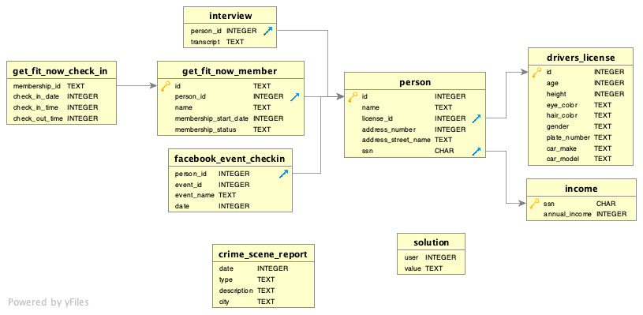

# The case
A crime has taken place and the detective needs your help. The detective gave you the crime scene report, but you somehow lost it. You vaguely remember that the crime was a ​murder​ that occurred sometime on ​Jan.15, 2018​ and that it took place in ​SQL City​. 

## Database Structure
The SQL Murder Mystery was built using SQLite.

## ERD

### Step 1
Retrieve the crime scene report from the police department’s database.

    SELECT * 
    FROM crime_scene_report 
    WHERE ='SQL city'
    AND date ='20180115';   

SELECT all rows from the crime_scene_report table where the value in the city column is 'SQL city', the location of the murder, and the date is '20180115' i.e. Jan 15th 2018, the date we've been told the murder took place.

### Step 2
